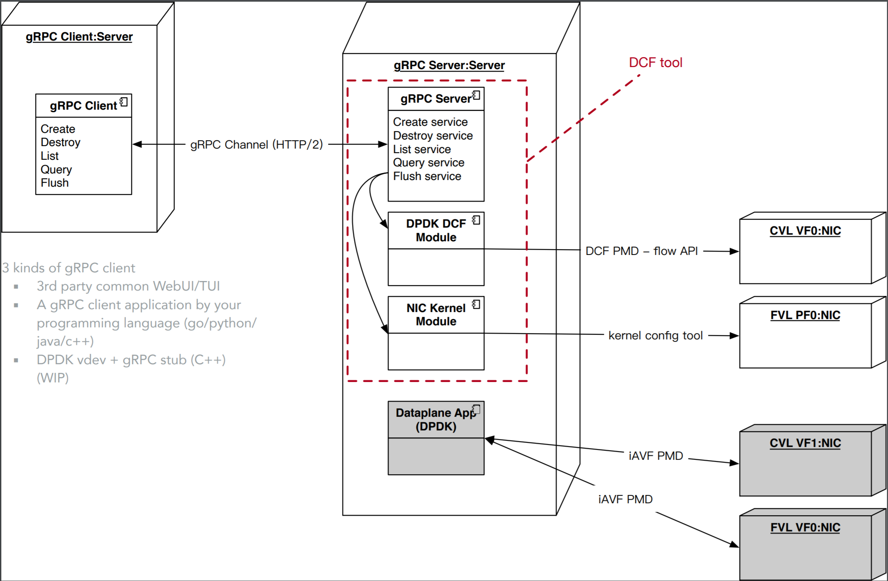

<!-- Copyright(c) 2021 Intel Corporation

Licensed under the Apache License, Version 2.0 (the "License");
you may not use this file except in compliance with the License.
You may obtain a copy of the License at

    http://www.apache.org/licenses/LICENSE-2.0

Unless required by applicable law or agreed to in writing, software
distributed under the License is distributed on an "AS IS" BASIS,
WITHOUT WARRANTIES OR CONDITIONS OF ANY KIND, either express or implied.
See the License for the specific language governing permissions and
limitations under the License.

-->

# Unified Flow Tool

## UFT deployment diagram



## Build DPDK wrapper in Python

DPDK wrapper is implemented in Cython, and DPDK lib should be compiled as shared library.

### Prepare DPDK shared library
Meson build

``` shell
cd <dpdk>
# With meson, both shared and static libraries are always built
meson --werror --default-library=shared x86_64-native-linuxapp-gcc
ninja -C x86_64-native-linuxapp-gcc
cd <dpdk>/x86_64-native-linuxapp-gcc
meson install
```

Make build

``` shell
cd <dpdk>
vim config/common_base
# Change the CONFIG_RTE_BUILD_SHARED_LIB=Y
make install -j T=x86_64-native-linuxapp-gcc
```

### Install Cython Environment

``` shell
pip3 install cython
pip3 install setuptools
```

### Build DPDK wrapper
#### Modify the setup.py with your DPDK location

``` shell
cd lib
vim setup.py
# Change the lib_dirs and inc_dirs variable to your dpdk library's installation directory, such as
# lib_dirs = ['/usr/local/lib/x86_64-linux-gnu']
# inc_dirs = ['/usr/local/include']
# Change the lib_ver variable to your dpdk library's version, such as
# lib_ver = ['v22.03']

python3 setup.py build_ext --inplace
```
#### Or you can build wrapper directly
``` shell
cd lib
python3 setup.py build_ext --inplace --dpdkver=<dpdk version> --dpdklib=<dpdk library directory> --dpdkinc=<dpdk include directory>
```
That will generate a _dpdk.cython-<your-target>.so_ in current lib folder

## Generate gRPC client/server code

Prepare the grpc protoc tools

``` shell
pip3 install grpcio-tools
pip3 install grpcio-reflection
```

Compile the flow protobuf to Python code

``` shell
cd rpc
python3 -m grpc_tools.protoc -I./ --python_out=. --grpc_python_out=. flow.proto
```
That will generate _flow_pb2_grpc.py_ and _flow_pb2.py_.

``` shell
python3 -m grpc_tools.protoc -I./ --python_out=. --grpc_python_out=. qos.proto
```
That will generate _qos_pb2_grpc.py_ and _qos_pb2.py_.

## Generate gRPC authentic certification

Create Root signing Key

``` shell
openssl genrsa -out ca.key 4096
```

Generate self-signed Root certificate

``` shell
openssl req -new -x509 -key ca.key -sha256 -subj "/C=US/ST=NJ/O=CA, Inc." -days 365 -out ca.cert
# you can modify /C=US/ST=NJ/O=CA, Inc. to fit your location and imaginary CA name
```

Create a Key certificate for the Server

``` shell
openssl genrsa -out server.key 4096
```

Create a signing CSR

``` shell
openssl req -new -key server.key -out server.csr
# complete the questons about country/state/city/orgnization/
# important! *common name should be set to your URL*
# for testing without domain name, use localhost as server name
```

Generate a certificate for the Server

``` shell
openssl x509 -req -in server.csr -CA ca.cert -CAkey ca.key -CAcreateserial -out server.pem -days 365 -sha256 -extensions req_ext
```

## Run gRPC server

``` shell
# Configure server_conf.yaml

server :
   server_port : 50051
   ld_lib : "/root/home/dpdk-dcf/x86_64-native-linuxapp-gcc/" # Point to your dpdk lib (installation directory)
   cert_key : "/root/dcf-tool/my_certs/server.key" # Point to the key certificate for the server
   cert_certificate : "/root/dcf-tool/my_certs/server.pem" # Point to the certificate for the server

ports_info :
         - pci  : "0000:86:00.1" # Configure to your NIC port, mode = kernel is not implemented.
           intf : enp25s11
           mode : kernel
         - pci  : "0000:18:11.0" # Configure to your NIC port, mode = dcf, only support CVL DCF port
           intf : enp24s17
           mode : dcf
```

#### How to generate CVL DCF port, Refer to [CVL DCF test plan](#todo)

> Generate 1 trust VF on 1 PF, and request 1 DCF on the trust VF.
> PF should grant DCF mode to it.
>
> Generate 4 VFs on PF
>
> ```shell
> echo 4 > /sys/bus/pci/devices/0000:18:00.0/sriov_numvfs
> ```
>
> Set a VF as trust
>
> ``` shell
> ip link set enp24s0f0 vf 0 trust on
> ```
>
> Launch dpdk on the VF, request DCF mode
>
> ``` shell
> <dpdk>/usertools/dpdk-devbind.py -b vfio-pci 18:01.0
> ```
>

Launch gRPC server

``` shell
python3 server.py
```
If your dpdk library was not installed in LD_LIBRARY_PATH, you need to
``` shell
export LD_LIBRARY_PATH=${LD_LIBRARY_PATH}:<dpdk library directory>
```
## Run 3rd party gRPC client (gRPC UI)

### Install gRPC UI

Please refer to [gRPC UI github](https://github.com/fullstorydev/grpcui)

### Launch gRPC UI server

```
/root/go/bin/grpcui -plaintext -import-path /home/dcf-tool/rpc -proto flow.proto -port 80 -bind 0.0.0.0 localhost:50051
```

## Build a gRPC client which implements DPDK vdev API

TODO
